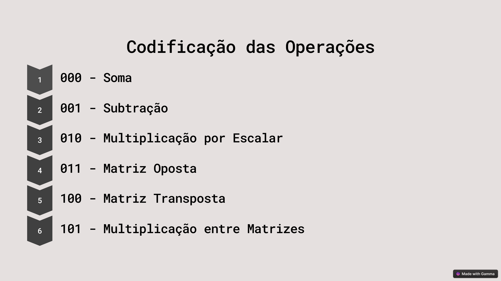
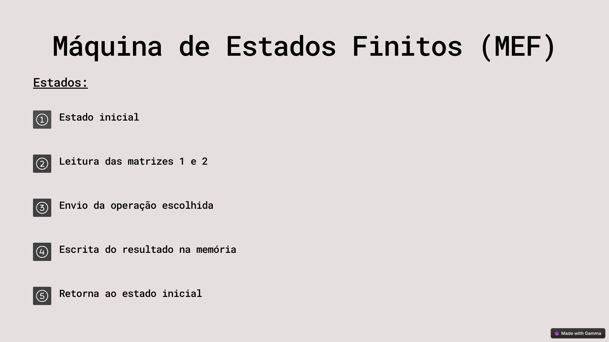

  <h1> Desenvolvimento de Coprocessador Aritmético para Operações com Matrizes </h1>
  <h3> Universidade Estadual de Feira de Santana </h3>
  <h3> TEC499 (TP04) - MI Sistemas Digitais </h3>
  <h4> Gabriel Vitor Nogueira da Silva, Luana Pedreira Oliveira e Lucca de Almeida Hora Coutinho </h4>

## Introdução

	Operações com matrizes são muito comuns em áreas como processamento de imagens, aprendizado de máquina, simulações científicas e telecomunicações. Como essas aplicações costumam exigir muitos cálculos, usar um coprocessador dedicado pode acelerar o processamento e melhorar o desempenho do sistema.

	Este projeto tem como objetivo desenvolver um coprocessador aritmético para realizar operações com matrizes quadradas de até 5x5 elementos, utilizando a placa DE1-SoC. O sistema será implementado em Verilog e realizará operações como adição, subtração, multiplicação, transposição, cálculo de determinante, entre outras. Além disso, o coprocessador será capaz de trabalhar em paralelo e utilizar arquitetura pipeline para tornar o processamento mais rápido, comunicando-se com o processador ARM da placa por meio de um barramento simples. 

## Softwares Utilizados e Kit de Desenvolvimento

	Durante o desenvolvimento do projeto, foi utilizado o software Intel Quartus Prime, ferramenta essencial para criação e simulação de circuitos digitais em FPGAs. Com ele, foi possível escrever o código em Verilog, fazer a pinagem dos sinais de entrada e saída, instanciar memórias e configurar todos os recursos necessários da placa DE1-SoC. O Quartus também foi utilizado para compilar o projeto e gravar o bitstream na FPGA, permitindo testes práticos e validação do funcionamento do coprocessador. 

	No início do projeto, foi utilizado o DESim, um simulador simples voltado para testes e validação de circuitos desenvolvidos em Verilog. Ele foi útil nas primeiras etapas para verificar o funcionamento básico de alguns módulos, mas acabou sendo descartado por suas limitações em simulações mais complexas. Também foram feitas tentativas de uso do ModelSim, um simulador mais robusto e completo, mas não foi possível utilizá-lo com sucesso devido a dificuldades de configuração e integração com o projeto no Quartus.

	O projeto foi desenvolvido utilizando o Kit DE1-SoC, uma plataforma que combina um FPGA da Intel (Cyclone V) com um processador ARM integrado (HPS – Hard Processor System). Essa combinação permite criar sistemas embarcados complexos que integram hardware customizado e software. No projeto, o FPGA foi responsável por executar as operações com matrizes, enquanto o processador ARM foi utilizado para enviar comandos e interagir com o coprocessador. O kit também oferece diversos recursos de entrada e saída, como chaves, LEDs e memória, que foram utilizados ao longo do desenvolvimento e testes.

    
     
    <b>Figura 1.</b> Kit de Desenvolvimento DE1-SoC. <b>Fonte:</b> Terasic.

## Arquitetura do Computador

	 A arquitetura do computador em questão é composta por uma combinação entre os recursos da FPGA e a interface de entrada e saída oferecida pela placa, como switches, botões e LEDs. 

	O coprocessador aritmético proposto foi mapeado exclusivamente na lógica programável da FPGA, utilizando blocos de hardware descritos em Verilog. O projeto não utiliza o processador ARM embutido na DE1-SoC, focando apenas no lado FPGA.

	A comunicação com o mundo externo é realizada por meio dos seguintes periféricos físicos:
	Switches (SW[2:0]): responsáveis por selecionar a operação aritmética a ser executada.
	Botão KEY[0]: usado para avanço manual da máquina de estados que controla o fluxo de execução.
	LEDs vermelhos (LEDR[2:0]): indicam visualmente o estado atual da máquina de controle do sistema.
	JTAG (via cabo USB Blaster): utilizado para programação da FPGA e comunicação com o In-System Memory Content Editor (ISMCE), que permite a leitura e escrita direta nos blocos de RAM do sistema.

	A memória utilizada é uma RAM do tipo 1-Port implementada com o IP Catalog do Quartus. Ela possui 256 posições de 256 bits cada, permitindo armazenar matrizes inteiras em um único endereço, o que otimiza a leitura e escrita de dados. A comunicação entre a FSM e a memória é feita de forma síncrona, utilizando sinais de controle padrão (clock, address, data, wren, etc.).

	O projeto não requer comunicação com outros sistemas nem com o processador ARM embutido, funcionando de forma autônoma. Todas as entradas e saídas são mapeadas diretamente para os pinos físicos da FPGA, respeitando a pinagem da DE1-SoC definida no arquivo .qsf.

    
     
    <b>Figura 2.</b> Tabela de codificação das operações matemáticas. <b>Fonte:</b> Os autores.

	Além disso, o projeto implementa uma máquina de estados finitos (MEF), responsável por sequenciar as operações de leitura das matrizes da memória, execução da operação escolhida e gravação do resultado na RAM.

    
     
    <b>Figura 3.</b> Estados da MEF utilizada. <b>Fonte:</b> Os autores.

## Preparação do Ambiente de Desenvolvimento

	Para o desenvolvimento e teste do coprocessador, foi necessário preparar um ambiente compatível com a placa DE1-SoC e com a linguagem Verilog. A seguir, estão descritos os passos realizados:

### Descrição de Instalação

Foi feito o download e a instalação da versão Lite do Intel Quartus Prime, que é gratuita e compatível com o FPGA Cyclone V presente no kit DE1-SoC. Disponível em: https://www.intel.com/content/www/us/en/software/programmable/quartus-prime/download.html.

### Configuração de Ambiente

	
**Criação do Projeto no Quartus:**
Um novo projeto foi criado no Quartus, com a seleção do dispositivo Cyclone V – 5CSEMA5F31C6, correspondente ao FPGA da DE1-SoC.

**Escrita do Código em Verilog:**
Todos os módulos do coprocessador foram desenvolvidos em linguagem Verilog. Os arquivos .v foram adicionados ao projeto por meio da interface do Quartus.

**Pinagem (Assignment Editor):**
Os sinais do projeto foram associados aos pinos físicos da placa utilizando o Assignment Editor, conforme o manual de pinagem da DE1-SoC.

**Instanciação de Memórias e IPs:**
Foram utilizados recursos como memórias embutidas (RAMs) e outros componentes internos da FPGA, instanciados diretamente no Quartus.

### Execução

	
**Compilação do Projeto:**
Após a configuração do projeto, o Quartus compilou os arquivos Verilog e gerou o arquivo bitstream (.sof).

**Gravação na FPGA:**
Com a placa conectada via USB, o bitstream foi carregado na FPGA através do Programmer e do Quartus.

**Configuração da memória:**
Para inserir os dados das matrizes na memória, foi utilizada a ferramenta In-System Memory Content Editor do Quartus. A memória RAM foi criada utilizando o bloco de IP "RAM 1-PORT", devidamente instanciado no projeto e configurado para armazenamento das matrizes. Por meio do In-System Memory, foi possível escrever e visualizar os conteúdos das matrizes em tempo real durante os testes.

**Testes na Placa:**
As operações foram testadas diretamente na DE1-SoC, utilizando chaves (switches), botões e LEDs para entrada e visualização dos resultados. Em versões futuras, o processador ARM (HPS) pode ser utilizado para enviar comandos diretamente ao coprocessador por meio de um barramento de controle simples.

## 

## Testes de Funcionamento do Sistema e Análise dos Resultados

Após a implementação, foram realizados testes para verificar a correta operação do coprocessador. A estratégia de teste consistiu na inserção manual dos valores das matrizes diretamente na memória RAM utilizando a ferramenta **In-System Memory Content Editor**. 
 

As operações testadas incluíram:

- **Adição de matrizes**
- **Subtração de matrizes**
- **Multiplicação por escalar**
- **Multiplicação de matrizes**
- **Transposição de matriz**
- **Matriz oposta**

> **Observação importante:** A operação de **determinante** foi inicialmente planejada, mas não chegou a ser implementada na versão atual do projeto.

Durante os testes, as matrizes foram preenchidas com valores inteiros, e as operações foram acionadas através das chaves da placa DE1-SoC. Os resultados foram observados diretamente na memória RAM por meio da ferramenta de visualização integrada no Quartus. Essa abordagem permitiu validar o funcionamento correto dos módulos, garantindo que os cálculos estavam sendo realizados conforme esperado. 
 

### Análise dos Resultados

O coprocessador demonstrou boa performance na execução das operações matriciais básicas, realizando os cálculos de forma rápida e correta.  
O uso da ferramenta **In-System Memory Content Editor** foi fundamental para a escrita e leitura dos dados na memória RAM durante os testes, simplificando o processo de verificação dos resultados. 
 

A comunicação entre os módulos de controle, unidades operacionais e a memória foi realizada de maneira eficiente.  
Como a operação de **determinante** não foi finalizada, algumas funcionalidades planejadas para análise de matrizes ficaram de fora nesta etapa, mas as operações concluídas comprovam a viabilidade e estabilidade do sistema desenvolvido. 
 

## Conclusão

 O desenvolvimento deste projeto proporcionou uma experiência prática essencial para a compreensão da integração entre hardware e software utilizando a placa DE1-SoC. Conseguimos implementar com sucesso as operações básicas entre matrizes, realizando a leitura e escrita na memória RAM 1-Port, o que demonstrou uma comunicação eficiente entre os componentes. O projeto também exigiu a criação de diversos módulos especializados, cada um com funções bem definidas para garantir a organização e a eficiência do coprocessador. Desde o início, priorizamos a modularidade do sistema, visando facilitar futuras expansões e simplificar a manutenção do código. 
 

 Durante o desenvolvimento, enfrentamos algumas dificuldades, principalmente relacionadas à comunicação com a FPGA e à depuração dos módulos de memória e controle. No entanto, essas barreiras contribuíram significativamente para o nosso aprendizado, impulsionando-nos a buscar soluções criativas e a explorar mais profundamente a documentação e os recursos disponíveis da plataforma. 
 

 Os módulos desenvolvidos demonstraram-se funcionais e bem estruturados. Embora o projeto tenha contemplado as operações básicas, como adição, subtração, multiplicação entre matrizes, multiplicação por escalar, matriz oposta e transposição, não foi possível implementar o cálculo do determinante devido à sua complexidade adicional e às limitações de tempo. 
 

 Como próximos passos, pretendemos aprimorar a eficiência de algumas operações, incluir a implementação do cálculo do determinante e explorar a possibilidade de paralelismo mais avançado. Além disso, buscamos expandir as capacidades do coprocessador para suportar operações matemáticas ainda mais complexas. 

